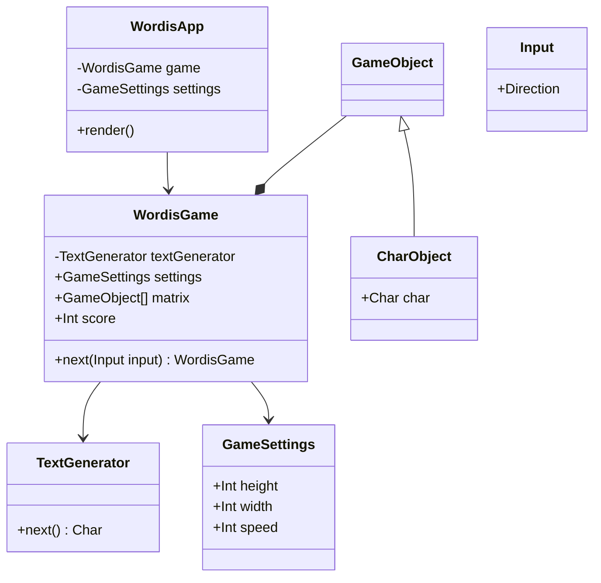

# Architecture

## Technology
- [React Native](https://reactnative.dev/)
- [TypeScript](https://www.typescriptlang.org/)

## Design

### Notes
- WordisApp is a React Native App;
- WordisGame is an object encapsulating pure and decoupled game logic;

### UML class diagram

